# WhatsApp Voice Notes Agent

AI-powered WhatsApp assistant that transcribes voice notes and text messages, extracts actionable intelligence, and saves everything to a searchable Google Sheet.

## Features

- 🎙️ **Voice Note Transcription** - Automatically transcribes voice messages (multi-language support)
- 📝 **Text Message Processing** - Save text notes with "keepAI" trigger
- 🧠 **AI Analysis** - Extracts summaries, action items, deadlines, and shopping lists
- 📊 **Google Sheets Integration** - All notes saved to a searchable spreadsheet
- ✅ **Instant Confirmation** - User receives summary via WhatsApp

## Architecture

```mermaid
flowchart LR
    subgraph User
        WA[📱 WhatsApp]
    end
    
    subgraph Meta
        API[Meta Cloud API]
    end
    
    subgraph Your Server
        WH[Webhook Server<br/>FastAPI]
        GEM[Gemini AI<br/>Vertex AI]
    end
    
    subgraph Google
        GS[📊 Google Sheets]
    end
    
    WA -->|Voice/Text| API
    API -->|Webhook| WH
    WH -->|Audio/Text| GEM
    GEM -->|Analysis| WH
    WH -->|Save| GS
    WH -->|Confirmation| API
    API -->|Reply| WA
```



## Message Flow

```mermaid
sequenceDiagram
    participant U as User
    participant W as WhatsApp
    participant S as Webhook Server
    participant G as Gemini AI
    participant D as Google Sheets
    
    U->>W: Send voice note / "keepAI" text
    W->>S: Webhook POST
    S->>U: "Processing..." ✅
    S->>G: Analyze content
    G->>S: Summary + Action Items
    S->>D: Save to spreadsheet
    S->>U: Confirmation + Summary
```



## Setup

### Prerequisites

- Docker & Docker Compose
- Google Cloud Project with Vertex AI enabled
- Meta WhatsApp Business API account
- Google Service Account with Sheets API access

### Environment Variables

Create a `.env` file (see `.env.example`):

```bash
META_API_TOKEN=your_permanent_token      # From Meta System User
META_PHONE_NUMBER_ID=your_phone_id       # From WhatsApp API Setup
SPREADSHEET_ID=your_sheet_id             # From Google Sheets URL
```

### Quick Start

```bash
# 1. Clone the repo
git clone https://github.com/amanz81/whatsappAgent.git
cd whatsappAgent

# 2. Add your service-account.json (Google Cloud)

# 3. Create .env with your credentials

# 4. Run
docker-compose up -d

# 5. Expose webhook (development)
ngrok http 8082
```

### Permanent Token Setup

To avoid token expiration, create a System User in Meta Business Settings:
1. Business Settings → System Users → Add
2. Assign your WhatsApp app with Full Control
3. Generate token with `whatsapp_business_messaging` permission

## Usage

### Voice Notes
Send a voice note to the WhatsApp Business number. The agent will:
1. Transcribe the audio (supports Hebrew, English, and other languages)
2. Extract action items, deadlines, shopping lists
3. Save to Google Sheets
4. Send confirmation with summary

### Text Messages
Include "keepAI" anywhere in your message:
```
keepAI remember to buy milk and call mom tomorrow
```

## Project Structure

| File | Purpose |
|------|---------|
| `webhook_server.py` | Main FastAPI webhook handler + Gemini integration |
| `google_drive_service.py` | Google Sheets save/append logic |
| `docker-compose.yml` | Container orchestration |
| `Dockerfile` | Python 3.10 Alpine container |
| `.env.example` | Template for environment variables |

## License

Private - All rights reserved
